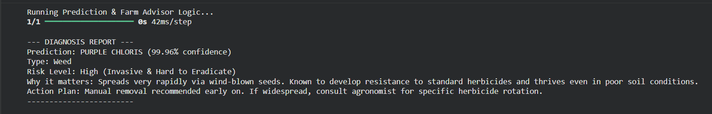

# ExplainCrop AI

ExplainCrop AI is an intelligent computer vision system designed to identify plants and weeds from images and provide actionable agricultural insights.

This project leverages deep learning with transfer learning (MobileNetV2) to classify plant species such as **Celosia Argentea**, **Crowfoot Grass**, and **Purple Chloris**. Beyond classification, the system integrates Explainable AI (Grad-CAM) to visually justify predictions and a smart advisory layer to guide user decisions.

---

## Features

*  Image-based plant & weed classification
*  Transfer learning using MobileNetV2
*  Explainable AI with Grad-CAM visualization
*  Smart advisory system (risk level + recommended action)
*  Optimized data pipeline for efficient training

---

## How It Works

1. User uploads an image
2. Model predicts plant/weed class
3. System determines:

   * Type (Weed / Useful Plant)
   * Risk level
   * Recommended action
4. Grad-CAM highlights regions responsible for prediction

---

## Tech Stack

* Python
* TensorFlow / Keras
* OpenCV
* NumPy
* Matplotlib

---

## Sample Output

*  Prediction with confidence score
*  Risk level (Low / High)
*  Action recommendation
*  Visual explanation (heatmap)
*  Sample Input
   
   
   Prediction Output
   

---
## Model Performance
Achieved over 95% accuracy on validation dataset with strong classification performance.

## Objective

To assist users and farmers in identifying harmful weeds and making informed decisions using AI-powered insights and explainable predictions.

---

## Note

* This project is developed and tested using **Google Colab**
* Some upload-related code (e.g., `files.upload()`) works only in Colab environment

---
## How to Run
1. Open the notebook in Google Colab  
2. Upload the dataset zip file  
3. Run all cells step by step  

## Future Improvements

* Expand dataset for better generalization
* Deploy as a web/mobile application
* Add real-time detection using camera input

---

## Key Highlight

This project goes beyond basic classification by combining:

* Deep Learning
* Explainable AI (XAI)
* Decision Support System

---

✨ *ExplainCrop AI demonstrates how AI can move from prediction to meaningful real-world impact.*
